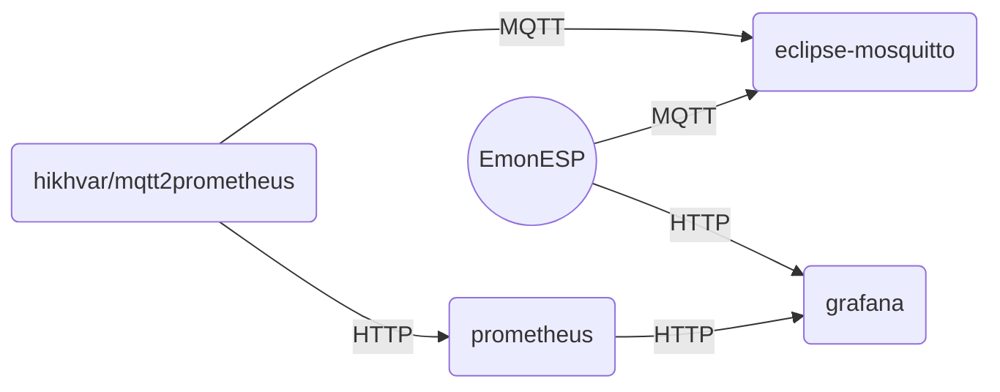

# EmonESP Grafana Dashboard

[EmonESP](https://github.com/openenergymonitor/EmonESP) is open source ESP8266 MCU software for monitoring energy consumption. Ready to use energy meter kits could be bought from places like [circuit setup shop](https://circuitsetup.us).

This repository contains docker container stack to create infrastructure for storing EmonESP data and visualize it with grafana dashboard.

## How it works

EmonESP publishing data to mosquitto MQTT server. [mqtt2prometheus]([GitHub - hikhvar/mqtt2prometheus: MQTT to Prometheus gateway](https://github.com/hikhvar/mqtt2prometheus)) is subscribed to EmonESP topics and  exports received data for prometheus which stores it as time series data. Grafana uses prometheus as data source to read historical power usage and calculate avg energy consumption and cost for period of time. Grafana also uses EmonESP API to query and display latest measured data and device status.

## Installation

### Requirements

1. EmonESP is setup and accessible via IP. MQTT is enabled and server IP points to machine where docker-compose stack will be deployed.

2. Docker is installed and daemon running.

3. Docker compose is installed.

### Deploy stack

1. Git clone this repository.

2. Go to emonesp-grafana directory.

3. Fill correct information in `.env` file.

4. Look at each stack component configuration file and change it to your needs:
   
   * `energy_monitor.json` line 1713 contains energy price in euros. You can change it here or later in grafana dashboard.
   
   * `mosquitto.conf` file is default, authentication and SSL/TLS are disabled.
   
   * MQTT base-topic in EmonESP should be `emon/emonesp`, but if you use something different update `prometheus2mqtt_config.yaml`

5. Run `docker-compose up -d`.

Grafana webUI should be accessible on port 3000, default login is `admin` and password `admin`. 

Select Dashboards menu > browse dashboards >  `Energy monitor`.
